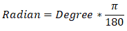
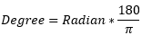
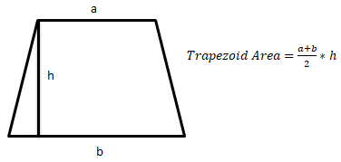
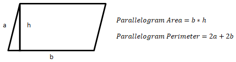
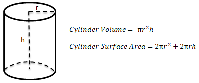
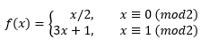

# Python Math Exercises
## . Exercise_1 - Convert Degree To Radian
Degree value of enter by user convert to radian value. 
The data type of entered value is checked. If data type is not integer, the error message is show. 
**_Radian Formula:_** 

## . Exercise_2 - Convert Radian To Degree
Radian value of enter by user convert to degree value. 
The data type of entered value is checked. If data type is not integer, the error message is show. 
**_Degree Formula:_** 

## . Exercise_3 - Trapezoid Area
The area of trapezoid is calculated. 
The data type of entered value is checked. If data type is not integer, the error message is show. 

## . Exercise_4 - Parallelogram Area and Perimeter
The area and perimeter of parallelogram is calculated. 
The data type of entered value is checked. If data type is not integer, the error message is show. 

## . Exercise_5 - Cylinder Area and Volume
The area and volume of cylinder is calculated. 
The data type of entered value is checked. If data type is not integer, the error message is show. 

## . Exercise_6 - Greatest Common Divisor
Greatest common divisior of two number is calculated. 
The data type of entered value is checked. If data type is not integer and entered number from lower than zero, the error message is show. 
## . Exercise_7 - Least Common Multiple
Least common multiple of two number is calculated. 
The data type of entered value is checked. If data type is not integer and entered number from lower than zero, the error message is show. 
## . Exercise_8 - Abundant Numbers
In the program, all abundant numbers are displayed up to the entered number value. 
**Abundant Number:** In number theory, an abundant number or excessive number is a number that is smaller than the sum of its proper divisors. The integer 12 is the first abundant number. Its proper divisors are 1, 2, 3, 4 and 6 for a total of 16. The amount by which the sum exceeds the number is the abundance. The number 12 has an abundance of 4, for example.  
Source: https://en.wikipedia.org/wiki/Abundant_number
## . Exercise_9 - Prime Numbers
All prime numbers up to the number entered user are displayed. 
**Prime Number:** A prime number is a number that is only divisible by itself and 1 without a remainder. 
First 10 prime numbers: 2, 3, 5, 7, 11, 13, 17, 19, 23, 29...
## . Exercise_10 - Collatz Sequence
The Collatz conjecture is a conjecture that states that all natural numbers greater than 1 can be reduced to 1. 
This conjecture can be show as a function as follow. 

Source: https://en.wikipedia.org/wiki/Collatz_conjecture 
## . Exercise_11 - Perfect Numbers
In the program, all perfect numbers are shown up to the entered number value. 
**Perfect Number:** In number theory, a perfect number is a positive integer that is equal to the sum of its positive divisors, excluding the number itself. For instance, 6 has divisors 1, 2 and 3 (excluding itself), and 1 + 2 + 3 = 6, so 6 is a perfect number. 
Source: https://en.wikipedia.org/wiki/Perfect_number
## . Exercise_12 - Fibonacci Sequence
In the program, the fibonacci sequence is shown up to the entered number. 
If user enters the 5 number, the program will show: [0,1,1,2,3] --> 5 pcs.
**Fibonacci Sequence:** In mathematics, the Fibonacci numbers, commonly denoted Fn, form a sequence, called the Fibonacci sequence, such that each number is the sum of the two preceding ones, starting from 0 and 1. 
Source: https://en.wikipedia.org/wiki/Fibonacci_number
## . Exercise_13 - Amicable Numbers
In the program, all amicable numbers are shown up to the entered number value. 
**Amicable Numbers:** Amicable numbers are two different numbers related in such a way that the sum of the proper divisors of each is equal to the other number. 
The smallest pair of amicable numbers is (220, 284). They are amicable because the proper divisors of 220 are 1, 2, 4, 5, 10, 11, 20, 22, 44, 55 and 110, of which the sum is 284; and the proper divisors of 284 are 1, 2, 4, 71 and 142, of which the sum is 220. (A proper divisor of a number is a positive factor of that number other than the number itself. For example, the proper divisors of 6 are 1, 2, and 3.) 
Source: https://en.wikipedia.org/wiki/Amicable_numbers
## . Exercise_14 - Armstrong Numbers
In the program, all armstrong numbers are shown up to the entered number value. 
**Armstrong Numbers:** Numbers that are equal to the sum of the cubes of the numerical values of the digits in all their digits are called "Armstrong numbers". 
Example: 153=1^3+5^3+3^3
## . Exercise_15 - Quadratic Equation Solver
The program finds the roots of the equation with two unknowns. 
